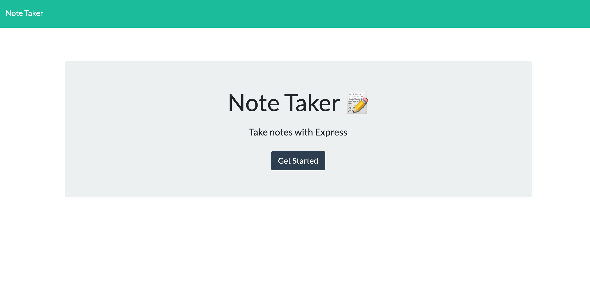
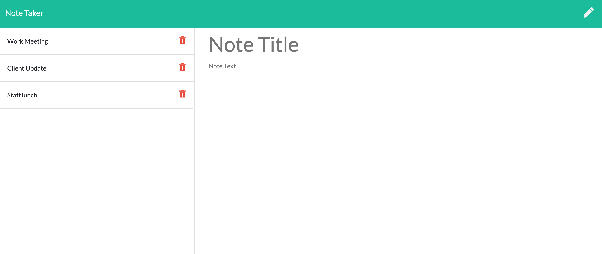
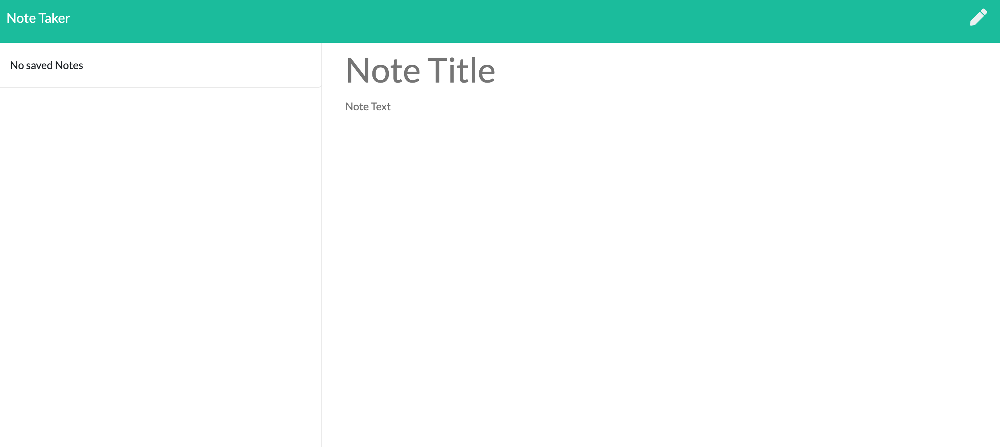

# company-note-taker

## Links:

Github: https://github.com/Yeatman51
Repository: https://github.com/Yeatman51/team-profile-generator
Live Demo: https://company-note-taker.herokuapp.com/

---

## Description:

This full stack application allows the end-user to quickly update notes. This application utilizes node and express servers and is hosted online through Heroku.
You were able to create new notes with a bold header and a body section after this task or note has been completed you are also able to delete it from the saved list. The images below demonstrate the homepage, adding new tasks, and removing them from the saved list.
---

